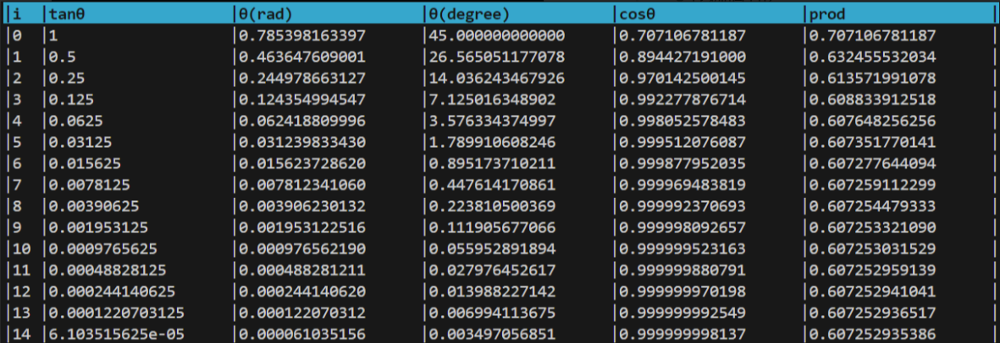

# <span class="hl">Cordic算法</span>

首先复习一下线性代数中有关<span class="hl warn">旋转矩阵</span>知识  
  
根据二维旋转矩阵的定义，二维数轴上点A$(x_0,y_0)$绕原点逆时针旋转$\theta$角度到点B$(x_1,y_1)$，相当于左乘一个旋转矩阵   
$$
\begin{equation}
\begin{bmatrix}
  x_1 \\
  y_1
\end{bmatrix}=
\begin{bmatrix}
  cos \theta & -sin \theta\\
  sin \theta & cos \theta
\end{bmatrix}
\begin{bmatrix}
  x_0 \\
  y_0
\end{bmatrix} 
\end{equation}
$$   
&emsp;     
&emsp;  
(1)式可以提取一个$cos\theta$变换为  
$$
\begin{equation}
\begin{bmatrix}
  x_1 \\
  y_1
\end{bmatrix}=cos\theta
\begin{bmatrix}
  1 & -tan \theta\\
  tan \theta & 1
\end{bmatrix}
\begin{bmatrix}
  x_0 \\
  y_0
\end{bmatrix} 
\end{equation}
$$
命（2）的右边后两项
$$
\begin{equation}
\begin{bmatrix}
  1 & -tan \theta\\
  tan \theta & 1
\end{bmatrix}
\begin{bmatrix}
  x_0 \\
  y_0
\end{bmatrix}
=
\begin{bmatrix}
  x_1' \\
  y_1'
\end{bmatrix}
\end{equation}
$$
可以先研究（3）以排除$cos\theta$的干扰，（2）就变为了下式 
$$
\begin{equation}
\begin{bmatrix}
  x_1 \\
  y_1
\end{bmatrix}=
cos\theta
\begin{bmatrix}
  x_1' \\
  y_1'
\end{bmatrix} 
\end{equation}
$$
根据式（4）,易知点$B'$在射线$OB$上,如下图所示  
(4)式表示点$A$旋转到点$B'(x_1',y_1')$  
  
由于旋转的过程中半径变了，因此称之为<span class="hl warn">伪旋转</span>  
&emsp;  
&emsp;       
&emsp;  
注意伪旋转的公式（4），还是含有$tan\theta$这样的非线性项，这对于硬件底层来讲（门电路）比较难计算  
如果伪旋转角度$\theta$满足  
$$
\begin{equation}tan\theta = 2^{-i}\end{equation}
$$
那么此时就只需要进行<u>移位操作</u>，而不再需要计算$tan\theta$，极大降低了计算复杂度，（4）就可以变为下面这样  
$$
\begin{equation}
\begin{bmatrix}
  x_1' \\
  y_1'
\end{bmatrix}=
\begin{cases}
\begin{bmatrix}
  1 & -2^{-i}\\
  2^{-i} & 1
\end{bmatrix}
\begin{bmatrix}
  x_0 \\
  y_0
\end{bmatrix} ,\theta\geq0\\
\\
\begin{bmatrix}
  1 & 2^{-i}\\
  -2^{-i} & 1
\end{bmatrix}
\begin{bmatrix}
  x_0 \\
  y_0
\end{bmatrix} ,\theta<0
\end{cases}
\end{equation}
$$
然而满足（5）式的只有特定的角度，可以编写代码如下  
```python
import math
print(f"\033[1;7;36m|{'i':<3}|{'tanθ':<20}|{'θ(rad)':<20}|{'θ(degree)':<20}|{'cosθ':<20}|{'prod':<20}|\033[0m")
prod = 1
for i in range(15):
    tan_theta = 2**(-i)
    angle = math.atan(tan_theta)
    angle_degree = angle*180/math.pi
    cos_theta = math.cos(angle)
    prod *= cos_theta
    print(f"|{i:<3}|{tan_theta:<20}|{angle:<20.12f}|{angle_degree:<20.12f}|{cos_theta:<20.12f}|{prod:<20.12f}|")
```
结果如下表所示  
  
  
可见旋转只有满足上述角度（45°，26.565°...），才可以将$tan\theta$简化为移位操作  

<div class="hb">
可实际旋转角度$\theta$，大概率都不是上述角度，该如何解决？
</div>
&emsp;    
&emsp;
&emsp;   
这就引出了Cordic算法的精髓： 
<div class="hb tip">
Cordic算法的核心在于<span class="hl warn">旋转的分解</span>：将从A到B，角度为$\theta$旋转(或伪旋转)，分解为多次旋转的叠加，如下式
$$
\begin{equation}\theta=\Sigma_{i=0}^{+\infty}\sigma_i\theta_i\end{equation}   
$$
其中$\theta_i=arctan(2^{-i})$,具体数值见上表，<br>       
$\sigma_i=\pm1$,为旋转方向，具体数值取决于如式（8）和（9）<br> <br> 
(7) 更直观的写法是
$$
\theta = \pm arctan(2^0)
 \pm arctan(2^{-1})
 \pm arctan(2^{-2})
 \pm arctan(2^{-3})...\\
\quad\\
或\\  
\quad\\
\theta = \pm 45^\circ
\pm 26.565^\circ
\pm 14.036^\circ
\pm 7.125^\circ...\\
$$
$$
\begin{equation}\varepsilon_i = \theta - \Sigma_{k=0}^{i-1}\sigma_k\theta_k\end{equation}
$$
$\varepsilon_i$是目标角度和已累加角度的误差
$$
\begin{equation}
\sigma_i =
\begin{cases}
    1 & \text{if } \varepsilon_i \geq 0 \\
    -1 & \text{otherwise}
\end{cases}
\end{equation}
$$
当迭代次数足够多时，可在一定误差允许下满足工程计算要求，逼近目标角度
</div>
示意图如下所示，将从A到B的旋转，分解为从A到C，从C到D.....，逐步减小且趋向于B的旋转   
  
用线性变换公式表示就是  
$$
\begin{equation}
\begin{bmatrix}
  x_B \\
  y_B
\end{bmatrix}= ...
cos\theta_1
\begin{bmatrix}
  1 & -\sigma_1 2^{-1}\\
  \sigma_12^{-1} & 1
\end{bmatrix}
\cdot cos\theta_0
\begin{bmatrix}
  1 & -\sigma_02^{0}\\
  \sigma_02^{0} & 1
\end{bmatrix}
\begin{bmatrix}
  x_A \\
  y_A
\end{bmatrix} 
\end{equation}
$$
可以看出伪旋转和旋转的区别就是一系列cos项  
$$
\prod_{i=0}^{+ \infty} cos\theta_i
$$
从前面的表格product一栏中可以看出，随着i增加，$\theta$减小，cos趋近于1，因此该累乘式是有极限的，对于9次以上的迭代一般都取0.60725   
因此式(10)可以变成   
$$
\begin{equation}
\begin{bmatrix}
  x_B \\
  y_B
\end{bmatrix}= ...
\begin{bmatrix}
  1 & -\sigma_1 2^{-1}\\
  \sigma_12^{-1} & 1
\end{bmatrix}
\cdot
\begin{bmatrix}
  1 & -\sigma_02^{0}\\
  \sigma_02^{0} & 1
\end{bmatrix}\cdot 0.60725 \cdot
\begin{bmatrix}
  x_A \\
  y_A
\end{bmatrix} 
\end{equation}
$$  
至此，已经可以大致知道从$A$绕原点旋转$\theta$到$B$点坐标的Cordic算法计算过程
<div class="hb">
但是，对于 <font color=#000000><b>"多次旋转就能逼近到目标角度"</b></font> 这个命题仍然存疑，需要严格证明一下
</div>
存疑主要来自于两处：  

1. 由于(7)式的项是递减的，是否会收敛导致无法逼近到一个较大目标角度？  

1. 迭代收敛处和目标值之间是否可能存在一个不随着迭代减小的误差？  
  

对于第一个问题，只需要对（7）求极限
$$
\Sigma_{i=0}^{+\infty} arctan(2^{-i})
$$
首先证明极限存在，   
根据比较判别法，当$x>0$时，$arctan(x)<x$，因此    
$$
arctan(2^{-i})<2^{-i},i\geq0
$$
由于公比为1/2的几何级数收敛，故所证级数极限也存在   
&emsp;   

现在对级数$\Sigma_{i=0}^{+\infty} arctan(2^{-i})$进行求和   
借助计算机，先求前21项的和$S_{20}\approx$1.743   
然后对余项进行估计，
$$
\begin{align*}
R_{20}&=\Sigma_{i=21}^{+\infty}arctan(2^{-i})\\
&<\Sigma_{i=21}^{+\infty}2^{-i}\\
&=2^{-20}\\
&\approx 9.537 \times 10^{-7}
\end{align*}
$$
因此所求级数可以认为1.743弧度（约为99.88°），第四象限证明完全一致。因此(7)式的最大范围可以覆盖$[-\pi/2,\pi/2]$,对于二三象限的问题，也可以利用对称性转化。因此第一个问题得到解决。   
&emsp;    
&emsp;   
对于第二个问题，将需要证明的命题转化为数学语言    
<div class="hb">
对任意目标角度$\theta\in[-\pi/2,\pi/2]$，第$i$次迭代误差$\varepsilon_i$(<font color=gray>由式(8),(9)确定</font>)，满足：
$$
|\varepsilon_i|\leq\Sigma_{k=i}^{+\infty}\theta_k 且 \lim_{i \to+\infty}|\varepsilon_i|=0
$$
</div>
使用数学归纳法证明：  
$i=0$时，$\varepsilon_0=\theta\in[-\pi/2,\pi/2]$,因此$|\varepsilon_0|\leq\Sigma_{k=0}^{+\infty}\theta_k\approx1.743$ 
</br>  
假设$i=m$时，$|\varepsilon_m|\leq\Sigma_{k=m}^{+\infty}\theta_k $   
则当$i=m+1$时，需要求证$|\varepsilon_{m+1}|\leq\Sigma_{k=m+1}^{+\infty}\theta_k $ 
其中，
$$
\varepsilon_{m+1}=\varepsilon_{m}-\sigma_m\cdot\theta_m
$$
分类讨论   
$(i). \sigma_m = 1$   
$$
\varepsilon_{m+1}=\varepsilon_{m}-\theta_m
$$
根据三角不等式，有
$$
|\varepsilon_{m+1}|=|\varepsilon_{m}-\theta_m|\leq|\varepsilon_{m}|-|\theta_m|
$$
$(ii). \sigma_m = -1$   


