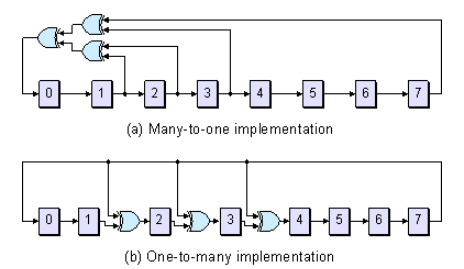

# LFSR(Linear Feedback Shift Register)
???+success "Reference"    
    《Verilog高级数字系统设计与实例分析》  
    [Tutorial: Linear Feedback Shift Registers (LFSRs)](https://www.edn.com/tutorial-linear-feedback-shift-registers-lfsrs-part-1/)   
    [MicroZed Chronicles: Linear Feedback Shift Register](https://www.adiuvoengineering.com/post/microzed-chronicles-linear-feedback-shift-register)   
    [CSDN:线性反馈移位寄存器(Linear Feedback Shift Register, LFSR)](https://blog.csdn.net/helaisun/article/details/103835889)

## 引入：衔尾之蛇
LSFR全称：线性反馈移位寄存器，由移位寄存器和异或门逻辑组成，下图是LSFR的一个例子
  
有Circuit和Symbol两种表示，通常用更简单的Symbol表示（但是要能和真实电路对应起来）  
由于移位寄存器的输出被**反馈**了回去，可以形象地与衔尾蛇Ouroboros联系起来    

  
如下图所示，给定一个初始值，LSFR就会按照一定周期循环计数   

  

👉由N个寄存器构成的LSFR，最多可能达到的状态数是$2^N-1$（取决于结构和初始状态） 
👉全0状态无法达到   

 

## 基本结构
LFSR分为两种结构：斐波那契（Many-to-one）和伽罗瓦（One-to-Many），根据其英文名可以很容易分辨出结构的不同    
  
回顾一下异或操作有如下两个特性：  
  
因此，上图中的Many-to-one就可以看成1，2，3，7输出全部异或(⊕)在一起再给到0   
所以有了下图更为简洁的方法来表示LSFR

---分割线---
下面还没完善

根据STA的基本知识，伽罗瓦的速度更快，因为寄存器前的组合逻辑更少

优势与应用：产生周期重复的伪随机序列，即相比同样状态数的计数器，逻辑门更少，速度更快

种子如何确定或如何输入给电路？rst_n赋值

抽头和反馈多项式的含义：根据书里给的两个例子能写出其多项式

最大状态是2^n-1,怎样的表达式能出现所有状态呢（算法）本原理论有点复杂，这里直接查表，需要根据表设计一个比如n=18的，两种都设计，然后仿真验证一下周期是否正确
https://www.cnblogs.com/wzx19970918/p/15728985.html

附加的可以找一篇论文看看