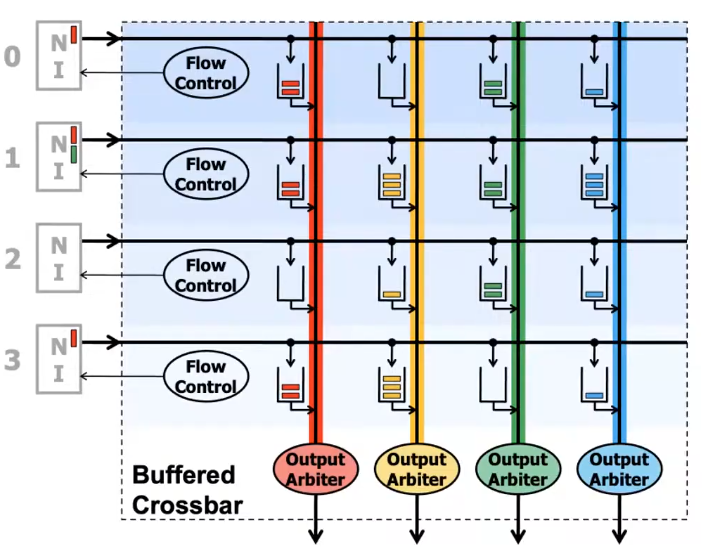

[TOC]
# NOC概述
可扩展性
性能
功耗
可靠性（出现坏点）
安全性（share domain访问攻击）
principles and practices of interconnection nets

3个important basics
Topology，如何硬连接
Rounting Algo，选什么路线（躲避拥堵），依赖拓扑
Buffer & FlowControl：如何传包，用flit，可以限制网络注入速率

NI,LINKS/CHANNEL(high level),ROUTER Node Flit

Message>Packet

## Topology
属性有如下几个
Regular（更理想的，路由更简单） 、 Irregular
Routing Distance：number of hops
Average ddistance
*Bisection Bandwidth*:描述网络的性能

Blocking 、Non-Blocking
Network是Blocking的，但是希望大部分时间工作在Non-Blocking状态

评估网络拓扑的矩阵（很多时候需要考虑物理情况，例如torus从t首到尾不可能真的只需要一跳，中间要插buffer）
Cost Latency Contention

<b>Bus</b>是最差的，因为是single link

<b>Point to Point</b> (每个Node之间都有一个独立连接)，延时最短，每个node需要N个端口，link复杂度是N2

<b>Cross Bar</b>所有的Node都可以连接到目标节点上，但是它们只能给目标节点一次给一个包，因此需要arbiter

Circuit不如Packest Switch   
Circuit好处是保证hop不会被人干扰   
Packet Switch需要rounter有   buffer，因为下一跳可能不   
available，所以需要等待   

大数据流是Circuit switch可能效率更高

Ring有单向和双向，ring可以做成多层次的

Array

Mesh

问题:但是考题中的link拓扑仅仅是简单的打拍，会造成很大的资源浪费吗？所以在拓扑中禁止使用buf，那么需要考虑多一个链接的意义和代价（可以看成是一个bypass，但是这个通路很容易就满了，由于反压，由于不存在很多buf，那么什么时候用它，就显得很宝贵。但从另一个角度来看，因为link cost很小，我是否可以例化非常多，以在拥堵时获得逃生。