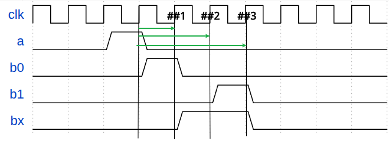
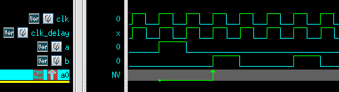

# <span class="hl warn">SVA</span>(SystemVerilog Assertion)
[TOC]
## 1 简介
<font color =ff6622 font size=4>SVA断言(**assert**)是用来描述设计<span class="btl">预期行为(**intended behavior**)</span>或<span class="btl">属性(**property**)</span>的一种简洁方式。   
断言是对<span class="btl">复杂时序的简单描述</span></font>   

利用断言可以检查RTL行为及属性是否符合设计要求
<div class="hb">
当然SVA不是描述和检查属性的唯一方式</br>
仅使用SV也可以实现，但是更加晦涩（写起来难，代码阅读起来也难），很难直接根据代码看出预期的属性
</div>

断言分为<span class="btl">即时(immediate)断言</span>和<span class="btl">并行(concurrent)断言</span>
### 1.1 即时断言
信号发生改变时进行立即检查，信号不变时不进行检查    
格式如下
```systemverilog
[assert  name]:assert (expr) 
    [pass_action]
[else]
    [fail_action]
```
除了第一行，剩下的称为执行块<span class="btl">action block</span>，可以省略       
<span class="hl info">执行块</span> action block<span class="btlr">只能包含一些打印语句(如``$display、$fatal和`uvm_error``等)，而不能写赋值语句</span>      
执行块的pass action只会在断言成功时执行（在**空成功**时不执行任何action）
!!! warning "即时断言只能在程序块中"
    程序块如always_comb、task、function等

举例如下
```sv
`ifdef MODULENAME_ASSERT_ON
always_comb begin
    a_checkAB:assert(A==B) 
        $display ("pass")
    else
        $fatal("assert %m failed");
end
`endif
```
上述代码注意点：    
1.使用<span class="btl">ASSERT宏开关</span>控制assertion的开启和关闭  
2.<span class="btl">`%m`</span>可以得到assert名  
  
### 1.2 并行断言
检查一段时序关系，可以持续监控数个周期，独立于过程块执行     
在每个采样时钟都检查（除非是满足disable iff()中的条件时，不进行检查）    
   
<span class="hl info">采样时钟</span>由于**并行断言**是持续监控数个周期的信号值，因此需要通过<span class="btl">采样时钟</span>来采样信号值(如`@(posedge clk)`)     
采样时钟采到的值是<span class="btlr">采样时钟边沿前一刻信号的值</span>(refer to `systemverilog的调度`)  
  
并行断言的格式如下，需要在property_expr中声明采样时钟   
```systemverilog
[assert  name]:assert property(property_expr) 
    [pass_action]
[else]
    [fail_action]
```
从格式上来看，直接区别就是assert后跟上了<span class="btl">`property`</span>    
举例如下
```sv
a_concurrent:assert property(@(posedge clk) a ##2 b);
```      

上例中代码需要检测如下行为：   
> 采到a为1，过两个采样时钟，采到b为1   

上面代码的断言仿真波形如下 <span class="hl warn">vcs</span> <span class="hl">verdi</span>  
!!! warning "不同工具断言波形表示不同"
    有的工具不在匹配结束点，而是在波形上在匹配开始点用箭头表示匹配的成功/失败
   
  

详细解析如下    
>①位置采到a=1,因此启动线程开始监测(图中`A_concurrent`绿色箭头起点)   
>经过两个采样时钟(图中`##1`和`##2`)    
>②位置采到b=1，因此持续监测满足断言要求的时序，在匹配成功结束处打上绿色箭头  


### 1.3 SVA 层次
verilog中的bool表达式只能简单地描述一个采样时钟沿各个信号的逻辑关系，而为了能够描述一段时间内的信号行为，就需要引入SVA中<span class="btl">序列(sequence)</span>的概念   
>前一节中的`a ##2 b`就是一个序列表达式    

```sv
sequence name_of_sequence;
    <test expression>;
endsequence
```
序列可以合成属性   
```sv
property name_of_property;
    <test expression>;   或
    <sequence_expression>;
endproperty
```
属性是断言检查的对象
```sv
assertion_name:
assert property (<property_name> 或 <test expression>);
```
SVA的层次化如下图所示，<font color = purple>**特别注意各个操作符所在的层级**</font>   
property层还需要补充一个: <font color=red font size =5>**not**</font>   
   
规范起见，**采样时钟**一般在属性中进行声明，<u>这样也可以保证定义的序列更有通用性</u>   
序列和属性都可以带<span class="btl">形参</span>，提高可复用性   
```sv
sequence s0(a,b);
    a ##2 b;
endsequence

//---------------

sequence s1;
    s0(req,ack) ##1 c;
endsequence
```
## 时序窗口
示例  
```sv
property p1;
    @(posedge clk) a ##[1:3] b;
endproperty
```
示例的属性表示：采样到a为高后,[1:3]个周期内，b至少在一个时钟周期为高   
时间窗口本质是<span class='btl'>在时钟边沿启动多个线程来检查</span>   
如示例中，检测到a为高，在该仿真时刻启动三个线程，分别在`##1`/`##2`和`##3`进行检查，如下图绿色箭头所示   

    
示例中的时序窗口按线程转换为等价形式为
```sv
a ##1 b 或者
a ##2 b 或者
a ##3 b
```
<span class = "btlr"><font color=purple>**最早成功的那个线程就会让整个时序窗口表达式成功(kill其他线程)，这是因为线程之间是或的关系**</font></span>
<div class="hb tip">
<b>补充说明:时序窗口与线程</b><br>
TODO TODO
</div>

```sv
property p0;
    @(posedge clk_delay) a |-> ##[1:5] (b,$display("%m:property success @%0t",$realtime));
endproperty
a0:
assert property(p0)
    $display("%m:assert success @%0t",$realtime);
```
如下图，尽管在第五个周期b也拉高了，也满足时序窗口，但是在波形上a0在b第一次拉高时就成功了  
并且第五周期b拉高也没打印出success信息，只有第二周期b拉高的成功打印  
  
  
  
   


<div class="hb warn">
为了避免仿真消耗过大，应当避免<br>      
1.在时序窗口前增加一些过滤条件，防止每个时钟上升沿都启动时序窗口多线程<br>   
2.不使用过大的时序窗口，否则会开启过多线程(可以用intersect对大窗口或无限窗口做约束,后续会提到该方法)<br>  
</div>


## 案例分析
### 001
如图所示，要求b在a拉起后,至少过1us再拉起    
要求断言检查出时隙<1us的情况   
  
   
**思路**：如果是周期要求，那么就很简单只需要用`## n`语法即可。   
而本例中要求检查的是具体时间，可以用系统函数来计算时隙大小   
```sv
`timescale 1ns/1ps
//错误示例
property p_check_slot1us_nofirst;
    real start_time;
    @(posedge clk_delay) ($rose(a),start_time=$realtime) |-> 
        ##[0:$] ($rose(b) && (($realtime-start_time)>=1000)); 
endproperty

//正确示例
property p_check_slot1us;
    real start_time;
    @(posedge clk_delay) ($rose(a),start_time=$realtime) |-> 
        first_match(##[0:$] ($rose(b)) && (($realtime-start_time)>=1000)); 
endproperty

A_slot1us:assert property(p_check_slot1us);
A_slot1us_nofirst:assert property(p_check_slot1us_nofirst);
```
<div class="hb warn">
<font color=purple font size =5><b>##[0,$]</b> 的无限期待feature</font><br>
特别注意<span class="btl"><b>first_match</b></span>函数在上面代码中的作用<br>    
如下图所示，如果没有firstmatch，<b>##[0,$]</b>这个特殊的线程就会一直匹配直到匹配成功为止<br>
这个线程尽管遇到后面条件失败，也不会认为失败，而是会认为在无限远的将来会匹配成功，因此会持续等待。也就是说除非运行时间结束，否则不会失败<br>
<br>
这个问题本质上也是<b>[a:b]等价展开</b>的问题，<span class="btl">展开式之间是或逻辑</span>，所以一个子项失败不算整体失败，而是继续期待
</div>  


  
