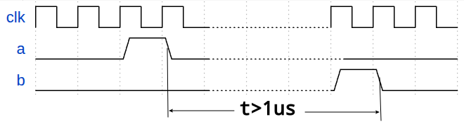
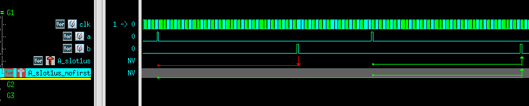

# <span class="hl warn">SVA</span>(SystemVerilog Assertion)
[TOC]
## 简介
<font color =ff6622 font size=4>SVA断言(**assert**)是用来描述设计<span class="btl">预期行为(**intended behavior**)</span>或<span class="btl">属性(**property**)</span>的一种简洁方式。   
断言是对<span class="btl">复杂时序的简单描述</span></font>   

利用断言可以检查RTL行为及属性是否符合设计要求
<div class="hb">
当然SVA不是描述和检查属性的唯一方式</br>
仅使用SV也可以实现，但是更加晦涩（写起来难，代码阅读起来也难），很难直接根据代码看出预期的属性
</div>

断言分为<span class="btl">即时(immediate)断言</span>和<span class="btl">并行(concurrent)断言</span>
### 即时断言
在代码执行到断言语句是进行立即检查    
格式如下
```systemverilog
[assert  name]:assert (expr) 
    [pass_action]
[else]
    [fail_action]
```
除了第一行，剩下的称为<span class="btl">action block</span>，可以省略
<div class="hb warn">
<font color=red><b>即时断言只能在程序块中</b></font></br>
如always_comb、task、function等
</div>
举例如下
```sv
`ifdef MODULENAME_ASSERT_ON
always_comb begin
    a_checkAB:assert(A==B) 
        $display ("pass")
    else
        $fatal("assert %m failed");
end
`endif
```
上述代码注意点：    
1.使用<span class="btl">ASSERT宏开关</span>控制assertion的开启和关闭  
2.<span class="btl">`%m`</span>可以得到assert名  
3.失败的action block还可以用<span class="btl">`$display`或者``uvm_error`</span>等其他log函数
  
### 并行断言
检查一段时序关系，可以持续监控数个周期，独立于过程块执行     
格式如下
```systemverilog
[assert  name]:assert property(property_expr) 
    [pass_action]
[else]
    [fail_action]
```
从格式上来看，直接区别就是assert后跟上了<span class="btl">`property`</span>    
举例如下
```sv
a_concurrent:assert property(@(posedge clk) a ##2 b);
```
需要引入<span class="hl info">采样时钟</span>的概念   
由于**并行断言**是持续监控数个周期的信号值，因此需要通过<span class="btl">采样时钟</span>来采样信号值(上面例子中的`@(posedge clk)`)     
采样时钟采到的值是<span class="btlr">采样时钟边沿前一刻信号的值</span>    

上例中代码需要检测如下行为：   
> 采到a为1，过两个采样时钟，采到b为1   

上面代码的断言仿真波形如下 <span class="hl">verdi</span>  
   
  

详细解析如下    
>①位置采到a=1,因此启动线程开始监测(图中`A_concurrent`绿色箭头起点)   
>经过两个采样时钟(图中`##1`和`##2`)    
>②位置采到b=1，因此持续监测满足断言要求的时序，在匹配成功结束处打上绿色箭头  


<div class="hb warn">
有的工具不在匹配结束点，而是在匹配开始点表示匹配的成功/失败
</div>

## 案例分析
### 001
如图所示，要求b在a拉起后,至少过1us再拉起    
要求断言检查出时隙<1us的情况   
  
   
**思路**：如果是周期要求，那么就很简单只需要用`## n`语法即可。   
而本例中要求检查的是具体时间，可以用系统函数来计算时隙大小   
```sv
`timescale 1ns/1ps
property p_check_slot1us;
    real start_time;
    @(posedge clk) ($rose(a),start_time=$realtime) |-> 
        first_match(##[0:$] $rose(b)) ##0 (($realtime-start_time)>=1000); 
endproperty
```
<div class="hb warn">
<font color=purple font size =5><b>##[0,$]</b> 的无限期待feature</font><br>
特别注意<span class="btl"><b>first_match</b></span>函数在上面代码中的作用<br>    
如下图所示，如果没有firstmatch，<b>##[0,$]</b>这个特殊的线程就会一直匹配直到匹配成功为止<br>
这个线程尽管遇到后面条件失败，也不会认为失败，而是会认为在无限远的将来会匹配成功，因此会持续等待。也就是说除非运行时间结束，否则不会失败<br>
<br>
这个问题本质上也是<b>[a:b]等价展开</b>的问题，<span class="btl">展开式之间是或逻辑</span>，所以一个子项失败不算整体失败，而是继续期待
</div>  


  
